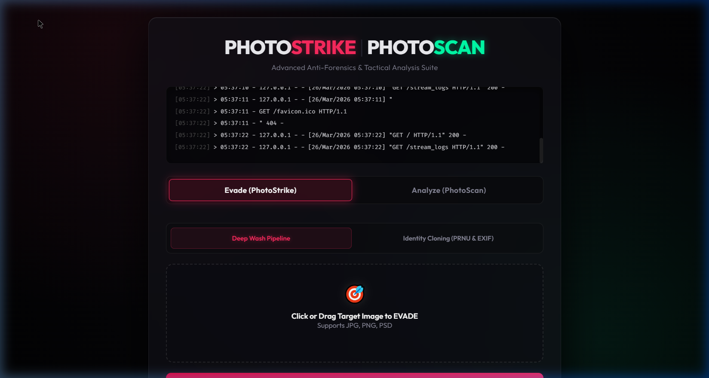

<div align="center">
  
# 🎯 PhotoStrike & PhotoScan
**A Premier Digital Anti-Forensics and Tactical Analysis Suite**

[](https://www.python.org/downloads/)
[](https://flask.palletsprojects.com/)
[](https://opensource.org/licenses/MIT)

*Advanced image sanitization, EXIF forging, PRNU cloning, and forensic detection in one unified Command Center.*

</div>

## 📌 Overview
PhotoStrike is an advanced, production-grade digital forensic and anti-forensic platform. It is designed to act as both a shield and a microscope. 

* **PhotoStrike (Evade Mode):** Strips away incriminating digital artifacts (like Photoshop traces or EXIF metadata) and actively defeats state-of-the-art forensic analysis tools by injecting mathematically precise noise matrices, cloning physical sensor fingerprints (PRNU), and obfuscating JPEG block artifacts.
* **PhotoScan (Analysis Mode):** A deep-dive forensic tool that visually exposes image manipulation, extracts raw proprietary payloads, and performs Error Level Analysis (ELA) to hunt for pasted objects or doctored pixels.

## 📸 Interface Preview


---

## 🚀 Key Features

### 🛡️ Tier-1 Anti-Forensics (Evasion)
1. **8x8 Block-Level DCT Normalization:** Modulates the High-Frequency AC components of the Discrete Cosine Transform inside 8x8 micro-blocks to defeat Double Compression (Benford's Law) detection algorithms.
2. **PRNU Sensor Fingerprint Cloning:** Isolates the exact microscopic physical silicon noise residual of a donor camera and multiplicatively injects it into the tampered image, deceiving camera identification tools.
3. **Statistical Histogram Matching:** Re-maps the RGB Probability Density Functions (PDF) of your altered image to mathematically mirror a clean, authentic donor photograph.
4. **Copy-Move Elastic Keypoint Defender:** Disrupts SIFT/SURF Keypoint mapping algorithms—used to detect Clone Stamp tools—via sub-pixel periodic sinusoidal warping.
5. **EXIF & Quantization Table (DQT) Forgery:** Completely replaces the file’s internal headers, thumbnail, and JPEG compression tables to match hardware signatures (e.g., Nikon, Canon).

### 🔬 Tactical Digital Forensics (Analysis)
1. **Error Level Analysis (ELA):** Calculates compression re-quantization error rates to generate a visual Heatmap of tampered (spliced) areas.
2. **Deep Payload Extraction:** Parses binary traces of Adobe XMP, Photoshop signatures, and proprietary software footprints hidden deep within file headers.

---

## 💻 Installation & Usage

### 1. Requirements
Ensure you have **Python 3.8+** installed.
```bash
git clone https://github.com/YOUR_USERNAME/PhotoshopAntiForensics.git
cd PhotoshopAntiForensics
pip install -r requirements.txt
```

### 2. Quick Start
For Windows users, simply launch the command center with a single click:
```bash
start_web.bat
```
The local server will boot and your default browser will automatically open the premium Glassmorphism Command Center UI at `http://127.0.0.1:5000`.

---

## 📂 Project Architecture

```
PhotoshopAntiForensics/
├── app.py                   # Central Flask Server & API Routing
├── start_web.bat            # 1-Click Launch Script
├── src/
│   ├── core/                # Anti-Forensics Evasion Algorithms
│   │   ├── prnu_forger.py
│   │   ├── dct_manipulator.py
│   │   ├── histogram_matcher.py
│   │   └── copy_move_defender.py
│   ├── analysis/            # Digital Forensic Scanners (ELA, Metadata)
│   └── utils/               # File Validation & System Logging
├── tests/                   # Forensic verification scripts and test assets
├── templates/               # Glassmorphism UI (index.html)
└── logs/                    # System activity logs
```

---

## 🔒 Security & Ethics Disclaimer
This tool was developed for **educational purposes, penetration testing, and forensic research**. The developer is not responsible for any misuse of this platform for malicious activities, fraud, or deception. 

<div align="center">
  <i>Defend your digital footprint. Expose the truth.</i>
</div>
